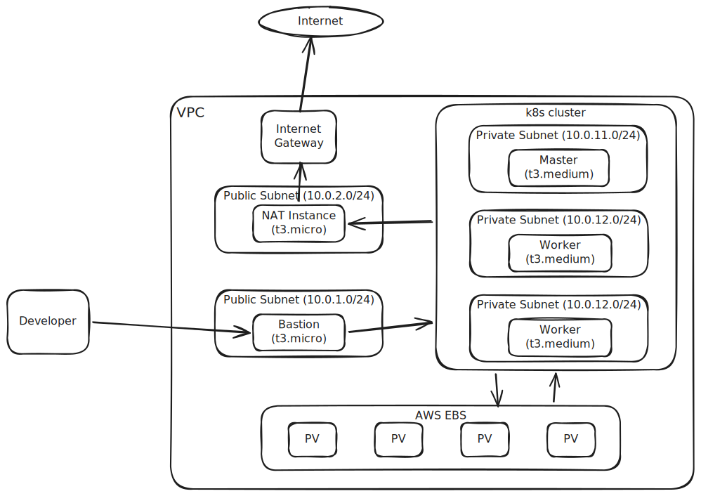

# Automated Kubeadm Kubernetes Cluster on AWS via Terraform & Ansible

An end-to-end automation platform for provisioning a highly secure, private Kubernetes cluster on AWS using Terraform for Infrastructure as Code (IaC) and Ansible for configuration management. It bootstraps a fully functional `kubeadm` Kubernetes control plane and worker nodes, completes networking with a custom cost-efficient EC2-based NAT instance, and deploys the official AWS EBS CSI Driver for dynamic volume provisioning.

---

## Architecture Overview

The infrastructure deploys resources within a dedicated Virtual Private Cloud (VPC), isolating the Kubernetes cluster in private subnets. External access is routed strictly through a Bastion host, and outbound internet access is managed via a custom, low-cost NAT Instance running `iptables` IP masquerading.

### Key Highlights
* **Zero EKS Overhead**: Eliminates the AWS EKS management fee ($73/month) by running native Kubernetes bootstrapped via `kubeadm`.
* **Cost-Efficient Routing**: Replaces the AWS NAT Gateway ($32/month base charge + data processing fees) with a single `t3.micro` EC2 NAT instance routing private traffic using Linux iptables, slashing NAT costs by over **75%**.
* **Hardened Security**: Control plane and worker nodes have **no public IP addresses** and reside entirely within private subnets. SSH access is limited to a single public Bastion host.
* **IAM Instance Profiles for CSI**: Node VMs use an IAM Role with custom policies allowing the in-cluster AWS EBS CSI driver to securely provision, attach, and detach EBS volumes on the fly.
* **Declarative Storage**: Installs the `gp3` storage class with encryption enabled by default (`ebs-gp3`), utilizing `WaitForFirstConsumer` volume binding for optimal scheduling.



---

## Directory Structure

```text
├── ansible/
│   └── kubeadm-cluster/
│       ├── ansible.cfg          # SSH proxy config and default connection settings
│       ├── inventory/
│       │   ├── group_vars/      # Cluster, CNI, runtime versions, and subnets vars
│       │   └── hosts.ini        # Dynamically populated host IP inventory
│       ├── playbooks/
│       │   └── site.yaml        # Main playbook orchestrating role deployment
│       └── roles/
│           ├── bastion/         # Configures Bastion host (Helm, EBS CSI, StorageClass)
│           ├── cni-calico/      # Deploys Tigera Operator and configures Calico network
│           ├── common/          # Configures OS prerequisites (Swapoff, sysctl, hosts)
│           ├── containerd/      # Installs containerd runtime & manages systemd cgroup
│           ├── crictl/          # Configures cri-tools debugging interface
│           ├── join-workers/    # Join script execution on worker nodes
│           ├── kube-packages/   # Installs kubelet, kubeadm, and kubectl apt packages
│           ├── kubeadm/         # Runs control-plane init, fetches Kubeconfig locally
│           ├── label-nodes/     # Labels worker nodes as node-role.kubernetes.io/worker
│           └── metrics-server/  # Installs Metrics Server with insecure TLS patch
├── docs/
│   ├── architecture.md          # In-depth architectural analysis
│   └── plan.md                  # Comprehensive project roadmap
├── scripts/
│   ├── create-cluster.sh        # Automates Terraform apply + Ansible playbook run
│   └── delete-cluster.sh        # Destroys all AWS infrastructure
└── terraform/
    ├── keys/                    # Locally generated SSH keypairs for cluster VMs
    ├── main.tf                  # Declares modules and top-level AWS resources
    ├── outputs.tf               # Infrastructure outputs (IPs, VPC IDs)
    ├── providers.tf             # AWS provider configuration
    ├── variables.tf             # VPC, CIDR, and Region declarations
    └── modules/
        ├── ec2/                 # EC2 wrapper module (fetches Ubuntu Resolute 26.04 LTS)
        ├── role/                # IAM Role & Instance Profile for AWS EBS CSI controller
        ├── security-groups/     # Security Group definitions for Bastion, NAT, Nodes
        └── vpc/                 # Network boundary, subnets, route tables setup
```

---

## Prerequisites

Before deploying the cluster, ensure the following CLI tools are installed on your host system:
* **Terraform** (>= 1.5)
* **Ansible** (>= 2.15)
* **AWS CLI** (configured with valid AWS access keys)
* **jq** (for script-based JSON parsing)

You must also have network access to an active AWS account with permissions to provision VPCs, EC2 instances, IAM roles, Security Groups, and Elastic IPs.

---

## Setup & Deployment Guide

Deployment is simplified into a single execution script that provisions AWS resources and triggers the Ansible configuration plays sequentially.

### 1. Configure AWS Credentials
Ensure your environment contains valid AWS credentials:
```bash
export AWS_ACCESS_KEY_ID="your_access_key"
export AWS_SECRET_ACCESS_KEY="your_secret_key"
export AWS_DEFAULT_REGION="ap-south-1" # Or your preferred region
```
Alternatively, configure a local AWS profile:
```bash
aws configure
```

### 2. Launch the Cluster
Run the bootstrap script from the root of the project repository:
```bash
bash scripts/create-cluster.sh
```

**What the script does:**
1. **Generates SSH Keys**: Creates an SSH keypair in `terraform/keys/ssh_key` if it does not already exist.
2. **Deploys Infrastructure**: Runs `terraform init` and `terraform apply -auto-approve` inside `terraform/`.
3. **Captures Outputs**: Saves Terraform variables locally to `terraform/terraform-output.tfout`.
4. **Updates Ansible Inventory**: Parses IPs and updates [hosts.ini](file:///home/debjoti/Documents/mega-project-1/ansible/kubeadm-cluster/inventory/hosts.ini), [kube_nodes.yml](file:///home/debjoti/Documents/mega-project-1/ansible/kubeadm-cluster/inventory/group_vars/kube_nodes.yml), and [control_plane.yml](file:///home/debjoti/Documents/mega-project-1/ansible/kubeadm-cluster/inventory/group_vars/control_plane.yml) dynamically.
5. **Initializes SSH agent forwarding**: Adds the key to your local `ssh-agent`.
6. **Configures host keys**: Connects and adds the public Bastion IP key to your host's `known_hosts`.
7. **Runs Ansible Playbook**: Triggers `ansible-playbook -i inventory/hosts.ini playbooks/site.yaml`.

---

## Verifying Cluster Status

Once the deployment completes, the Kubernetes cluster is ready.

### 1. Access the Cluster
All Kubernetes nodes reside in private subnets. Access the cluster using the Bastion host as an SSH gateway. The Bastion is pre-configured with `kubectl` and the admin `kubeconfig`.

SSH into the Bastion using the private key:
```bash
ssh -i terraform/keys/ssh_key ubuntu@<bastion_public_ip>
```
*(You can retrieve the `<bastion_public_ip>` from the final stdout of `create-cluster.sh` or by checking `terraform/terraform-output.tfout`)*

### 2. Check Node Health
From the Bastion command line, query node statuses:
```bash
kubectl get nodes -o wide
```
Example Output:
```text
NAME         STATUS   ROLES           AGE   VERSION   INTERNAL-IP
master-01    Ready    control-plane   5m    v1.35.0   10.0.11.x
worker-01    Ready    worker          4m    v1.35.0   10.0.12.x
worker-02    Ready    worker          4m    v1.35.0   10.0.12.y
```

### 3. Verify EBS StorageClass
Verify that the AWS EBS CSI driver has successfully registered the StorageClass:
```bash
kubectl get storageclass
```
Output:
```text
NAME                PROVISIONER        RECLAIMPOLICY   VOLUMEBINDINGMODE      ALLOWVOLUMEEXPANSION   AGE
ebs-gp3 (default)   ebs.csi.aws.com    Delete          WaitForFirstConsumer   false                  3m
```

### 4. Deploy Test Volume Claim
Apply a sample PersistentVolumeClaim (PVC) and Pod to test dynamic provisioning:

Save this manifest as `ebs-test.yaml` on the Bastion:
```yaml
apiVersion: v1
kind: PersistentVolumeClaim
metadata:
  name: ebs-claim
spec:
  accessModes:
    - ReadWriteOnce
  storageClassName: ebs-gp3
  resources:
    requests:
      storage: 4Gi
---
apiVersion: v1
kind: Pod
metadata:
  name: app-server
spec:
  containers:
  - name: app
    image: nginx
    volumeMounts:
    - name: storage
      mountPath: /data
  volumes:
  - name: storage
    persistentVolumeClaim:
      claimName: ebs-claim
```
Apply the resources:
```bash
kubectl apply -f ebs-test.yaml
```

Wait a few seconds for the Pod to schedule. Since volume binding is set to `WaitForFirstConsumer`, AWS will provision the EBS volume once the pod is assigned to a node:
```bash
kubectl get pvc
kubectl get pv
kubectl get pods app-server
```
If successful, you will see `ebs-claim` in `Bound` status, and an actual EBS volume created and attached to the target node in your AWS Console.

---

## Clean-up & Teardown

To avoid incurring charges on AWS, tear down all provisioned resources using the deletion script:
```bash
bash scripts/delete-cluster.sh
```
This runs `terraform destroy -auto-approve` and deletes local environment-specific configurations.
## **DISCLAIMER**
Delete any EBS volumes that were dynamically provisioned by the cluster, as they may persist after node termination and incur costs. You can find these volumes in the AWS Console under EC2 > Volumes, filtering by tags or creation time.
