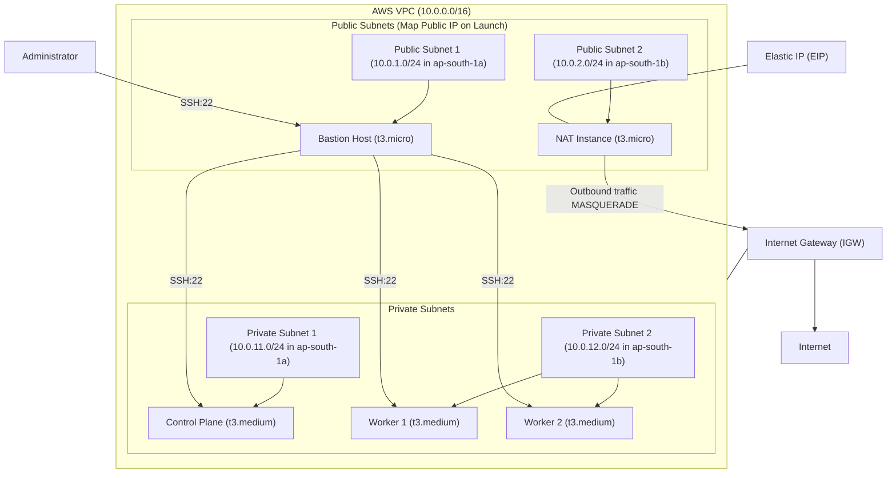
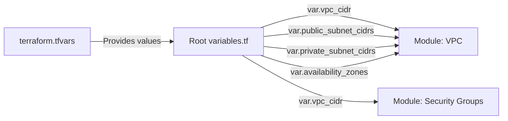
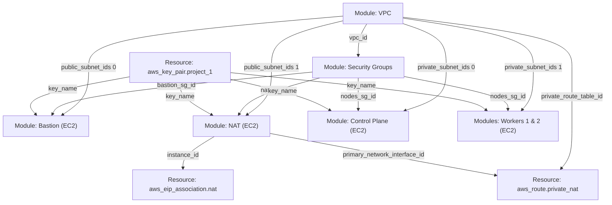

# Infrastructure Architecture Documentation

This document describes the AWS infrastructure architecture provisioned by Terraform for **Project 1**. It covers the layout of the network, the roles of each module, the flow of variables and outputs, security group designs, and the custom NAT routing setup.

---

## 1. Architectural Overview

The infrastructure creates a secure, private environment for a multi-node Kubernetes cluster. It comprises a Virtual Private Cloud (VPC), segregated public and private subnets, security groups enforcing the principle of least privilege, a Bastion host for administrative SSH access, a custom NAT EC2 instance for outbound internet connectivity from the private subnets, and three Kubernetes nodes (one control plane and two worker nodes).



---

## 2. Terraform Modules

The configuration is split into reusable components located in the `modules/` directory.

### A. VPC Module (`./modules/vpc`)
Responsible for provisioning the base network topology.
* **Resources:**
  * `aws_vpc.main`: Creates the primary network boundary. DNS hostnames and resolution are enabled.
  * `aws_subnet.public`: Dynamically spins up public subnets using `count` over `var.public_subnet_cidrs`. Sets `map_public_ip_on_launch = true`.
  * `aws_subnet.private`: Spins up private subnets using `count` over `var.private_subnet_cidrs`.
  * `aws_internet_gateway.igw`: Deploys an IGW to provide internet access to the public subnets.
  * `aws_route_table.public`: A public route table directing `0.0.0.0/0` traffic to the IGW.
  * `aws_route_table.private`: A private route table (routing details are injected externally at the root level).
  * `aws_route_table_association`: Associates public and private subnets with their respective route tables.

### B. Security Groups Module (`./modules/security-groups`)
Handles network-level firewalls.
* **Security Groups:**
  1. **`bastion-sg`**:
     * **Ingress:** Port 22 (SSH) open to `0.0.0.0/0` (anywhere).
     * **Egress:** All protocols, all ports allowed to `0.0.0.0/0`.
  2. **`nodes-sg`** (Applied to Kubernetes control plane and workers):
     * **Ingress:**
       * Port 22 (SSH) allowed *only* from the `bastion-sg` security group. This prevents direct external access to the nodes.
       * Port 6443 (Kubernetes API server) allowed from itself (`self = true`), enabling node-to-control-plane communication.
       * Port 10250 (Kubelet API) allowed from itself (`self = true`).
     * **Egress:** All traffic allowed to `0.0.0.0/0`.
  3. **`nat-sg`** (Applied to the NAT Instance):
     * **Ingress:** All protocols and ports allowed from the VPC CIDR block (`10.0.0.0/16`).
     * **Egress:** All protocols, all ports allowed to `0.0.0.0/0`.

### C. EC2 Module (`./modules/ec2`)
A generic wrapper module to launch standardized EC2 instances.
* **AMI Resolution:** Uses a `data "aws_ami" "ubuntu"` block to automatically look up the latest official Ubuntu Server 26.04 (Resolute) LTS image owned by Canonical (`099720109477`).
* **Resources:**
  * `aws_instance.this`: The EC2 instance resource. Dynamically accepts user-data, security group IDs, key names, and controls source/destination checking via variables.

---

## 3. Variable and Output Flow

Below is the complete path of variables and outputs from initialization down to resource creation.

### Variable Input Flow (Root to Modules)



1. **`terraform.tfvars`** contains variables such as the VPC CIDR (`10.0.0.0/16`), subnet blocks, and target availability zones.
2. **Root `variables.tf`** declares these variables, enforcing their types (`string`, `list(string)`).
3. **Root `main.tf`** reads these variables and supplies them to the modules:
   * **`vpc`** module accepts VPC CIDR, public/private subnet lists, and availability zones.
   * **`security_groups`** module accepts `vpc_cidr` to allow traffic from the internal network for the NAT instance.

---

### Output Dependency Flow (Inter-module & Root Resources)

To avoid hardcoded resource links, modules output IDs that are passed as inputs to other modules and resources.



Detailed explanation of the flow:
* **VPC outputs to Security Groups:** `module.vpc.vpc_id` is passed as the `vpc_id` argument to the `security_groups` module.
* **VPC outputs to EC2 instances:** Subnet IDs are mapped specifically:
  * Public Subnet 1 (`[0]`) is assigned to the `bastion` host.
  * Public Subnet 2 (`[1]`) is assigned to the `nat` instance.
  * Private Subnet 1 (`[0]`) is assigned to the `control_plane` node.
  * Private Subnet 2 (`[1]`) is assigned to `worker1` and `worker2`.
* **Security Groups outputs to EC2 instances:** The respective security group IDs (`bastion_sg_id`, `nodes_sg_id`, `nat_sg_id`) are passed to the `security_group_ids` argument of the instances.
* **NAT instance outputs to Root resources:** 
  * `module.nat.instance_id` is used by `aws_eip_association.nat` to attach the Elastic IP.
  * `module.nat.primary_network_interface_id` is used by the `aws_route.private_nat` resource to establish outbound routing for the private subnets.

---

## 4. Technical Details & Special Network Routing

### A. Custom NAT EC2 Instance Routing
Instead of utilizing an AWS managed NAT Gateway (which incurs hourly base charges), this architecture implements a cost-efficient **NAT Instance** using a standard EC2 micro instance (`t3.micro`).

For this custom routing to work, two critical configurations are implemented in Terraform:

1. **Source/Destination Check Disabled:**
   * By default, AWS EC2 instances check if they are the source or destination of any network traffic they receive. If they are not, they drop the packets.
   * Because the NAT instance is acting as a router/gateway (forwarding packets from the private subnets to the internet), it receives traffic that is not addressed to it.
   * Setting `source_dest_check = false` on the `nat` EC2 instance disables this rule:
     ```hcl
     # main.tf (under module "nat")
     source_dest_check = false
     ```
2. **Kernel-level Packet Forwarding and MASQUERADE:**
   * The NAT instance runs a script via `user_data` (located at [nat.sh](./userdata/nat.sh)).
   * The script performs the following tasks:
     * Enables IP forwarding in the running kernel: `sysctl -w net.ipv4.ip_forward=1`.
     * Persists the setting across reboots: `echo "net.ipv4.ip_forward = 1" >> /etc/sysctl.conf`.
     * Creates an `iptables` rule to perform NAT translation (MASQUERADE) on the primary network interface `ens5`: `iptables -t nat -A POSTROUTING -o ens5 -j MASQUERADE`.
     * Installs `iptables-persistent` to save and auto-reload the rule on startup.
3. **Private Route Table Modification:**
   * The root configuration adds a custom route inside `main.tf` targeting the private route table outputted by the VPC module:
     ```hcl
     # main.tf
     resource "aws_route" "private_nat" {
       route_table_id         = module.vpc.private_route_table_id
       destination_cidr_block = "0.0.0.0/0"
       network_interface_id   = module.nat.primary_network_interface_id
     }
     ```
   * All packets originating from private subnets destined for the internet (`0.0.0.0/0`) are sent to the NAT instance's network interface, translated, and routed out to the Internet Gateway.

### B. SSH Key Importation
* Rather than creating an AWS-managed SSH key pair from scratch or copying private keys into the cloud, the root configuration imports a pre-existing public key file:
  ```hcl
  resource "aws_key_pair" "project_1" {
    key_name   = "project_1"
    public_key = file("${path.module}/keys/project_1.pub")
  }
  ```
* The associated private key [project_1.key](./keys/project_1.key) remains local and is used by the administrator/Ansible to connect.

---

## 5. Outputs and Connection Information

Applying the configuration yields the following outputs (declared in [outputs.tf](./outputs.tf)):
* `vpc_id`: The ID of the created VPC.
* `public_subnets` / `private_subnets`: List of IDs of subnets.
* `bastion_public_ip`: The entrypoint public IP address.
* `control_plane_private_ip`, `worker1_private_ip`, `worker2_private_ip`: Internal IPs of the Kubernetes cluster nodes.
* `nat_public_ip`: Elastic IP associated with the NAT instance.

### SSH Connectivity Path
Since Kubernetes nodes are inside private subnets, you cannot connect to them directly from the internet. To SSH into a node:
1. Log in to the bastion host using its public IP and enable agent forwarding to securely use your local SSH key:
   ```bash
   ssh -A -i keys/project_1.key ubuntu@<bastion_public_ip>
   ```
2. From the bastion, connect to a private node using its private IP:
   ```bash
   ssh ubuntu@<node_private_ip>
   ```
